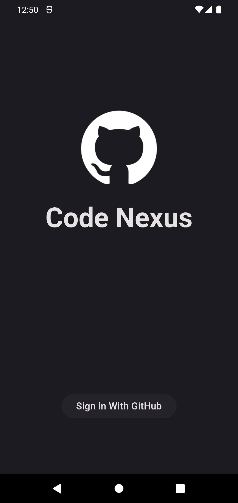
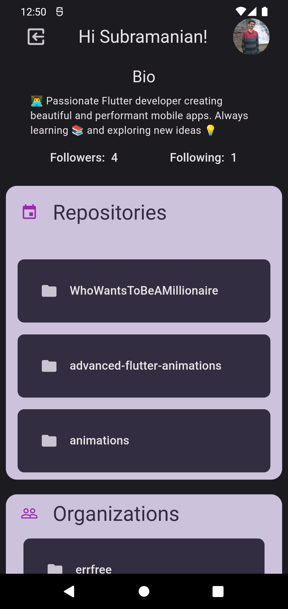
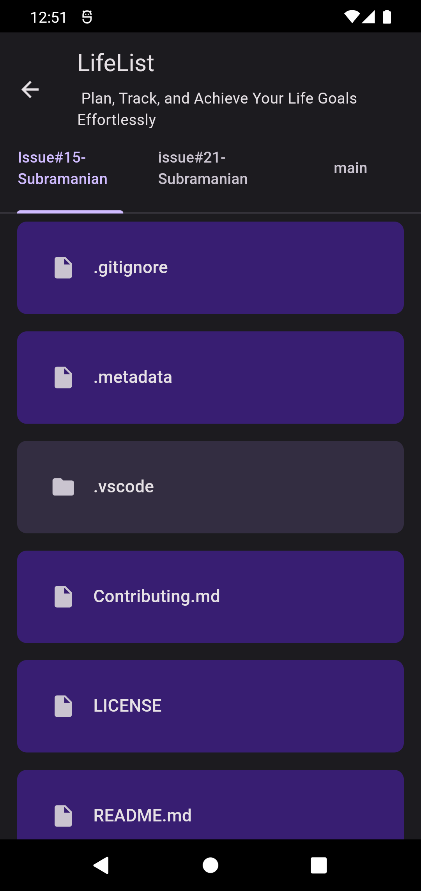
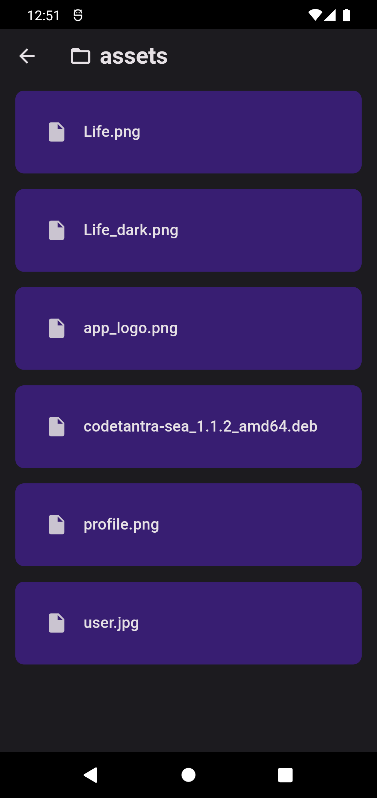

# Code Nexus

This Flutter project is a GitHub clone app called Code Nexus. It allows users to authenticate using GitHub through Firebase, view their basic information, repositories, organizations, and navigate through repository details and folder structures.
## Screens

### Screen 1: Login Page
Create a login page that enables GitHub authentication using Firebase.

### Screen 2: Home Page
The home page displays the user's basic information, including their username, full name, and profile icon. It also lists their repositories and organizations.

### Screen 3: Repository View Page
This page lists all the branches in a tab bar. Selecting a branch displays the files and folders within that branch. Clicking on a folder will open the page again, loading the files and sub-folders within that folder.

### Screen 4: File Explorer
The file explorer screen allows users to navigate through files and folders within a repository. Users can view files and sub-folders, and perform various actions related to managing the repository's contents.

## How to Run the App

Follow the steps below to run the Code Nexus app:

1. Clone this repository to your local machine.
2. Make sure you have Flutter installed. If not, follow the Flutter installation guide: [Flutter Installation](https://flutter.dev/docs/get-started/install).
3. Open a terminal and navigate to the project directory.
4. Run `flutter pub get` to install the required dependencies.
5. Connect a device or start an emulator.
6. Run `flutter run` to launch the app on your device/emulator.

## Screenshots

Here are some screenshots of the Code Nexus app:
| | | | |
|:-------------------------:|:-------------------------:|:-------------------------:|:-------------------------:|
| |   |  |  |

## Acknowledgements

This project utilizes the following technologies and libraries:

- Flutter: A UI toolkit for building beautiful, natively compiled applications for mobile, web, and desktop from a single codebase.
- Firebase: A mobile and web application development platform that provides backend services such as authentication, real-time database, and storage.
- GitHub API: The official GitHub API to interact with GitHub repositories and user data.
- go_router: A Flutter package that provides a declarative way to define and navigate between routes in your app.
- flutter_bloc: A predictable state management library that helps to manage the state of your Flutter app in a clear and manageable way.

## Contributing

Contributions to Code Nexus are welcome! If you encounter any issues or have suggestions for improvements, please create a new issue in the GitHub repository.

## License

The Code Nexus project is licensed under the [MIT License](LICENSE). Feel free to use, modify, and distribute this project as per the terms of the license.
